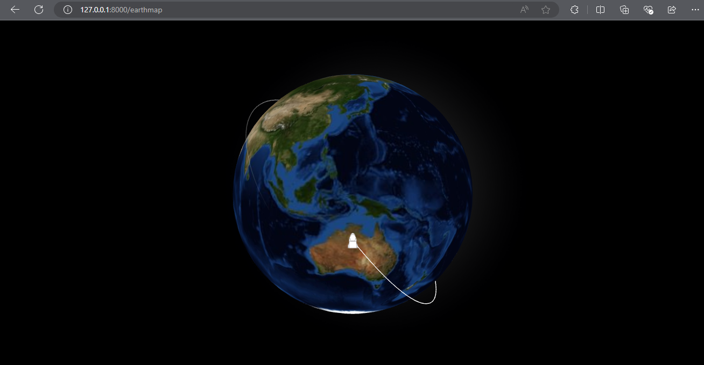

# Follow Dragon SpaceX




## Description

This project show case the SpaceX Dragon spacecraft in real-time and track orbital data.

## How to use

1. Clone the repository

    ```bash
    git clone https://github.com/ridwaanhall/follow-dragon-spacex.git
    ```

2. Upgrade PIP

    ```bash
    python -m pip install --upgrade pip
    ```

3. Install dependencies

    ```bash
    pip install -r requirements.txt
    ```

4. Run the application

    ```bash
    python manage.py runserver
    ```

5. Open your browser and navigate to <http://127.0.0.1:8000/>
